# DevHelp

Plataforma educacional de **gestão de chamados e atendimento técnico** desenvolvida em sala de aula, com evolução incremental desde a concepção até uma solução funcional completa.

> Este repositório representa um projeto aplicado para ensino de desenvolvimento web com .NET, arquitetura de software, UX moderna, autenticação, autorização, filas de atendimento e automações de operação.

---

## 📚 Contexto educacional

O `DevHelp` foi construído como projeto pedagógico, acompanhando os alunos em um ciclo completo de produto:

1. **Concepção da ideia** (problema real de atendimento em ambiente escolar)
2. **Levantamento de requisitos** (aluno, professor, admin)
3. **Modelagem de domínio** (usuário, chamado, fila, SLA, histórico)
4. **Implementação incremental** (sprints curtos com validação contínua)
5. **Refino visual e UX** (layout moderno e consistente)
6. **Operação e observabilidade funcional** (painel TV, histórico, exportações)
7. **Entrega final orientada a cenário real de uso**

A proposta é ensinar não só código, mas também:
- tomada de decisão técnica;
- evolução de arquitetura com regras de negócio;
- padronização de interface;
- documentação viva;
- manutenção e melhoria contínua.

---

## 🎯 Objetivo do projeto

Centralizar e organizar chamados de alunos para atendimento por professores/admin, com prioridade por urgência + tempo de espera, rastreabilidade de atendimento e interface de operação em tempo real.

## 🌐 Acesso ao sistema (ambiente publicado)

- `https://devhelp.somee.com`

---

## 🧩 Principais funcionalidades

### Identidade e acesso
- Autenticação com ASP.NET Identity.
- Papéis: `Aluno`, `Professor`, `Admin`.
- Regras de domínio de e-mail institucional.
- Confirmação de e-mail e recuperação de senha com templates HTML modernos.

### Fluxo de tickets
- Abertura de chamado pelo aluno com:
  - categoria;
  - prioridade;
  - descrição;
  - anexos opcionais;
  - links opcionais;
  - professor preferencial opcional.
- Número sequencial no padrão `AAAA-MM-000001`.
- SLA por prioridade.
- Comentários no ticket.
- Controle de status: `Aberto`, `Em atendimento`, `Resolvido`, `Fechado`, `Cancelado`.

### Regras de atendimento
- Fila ordenada por métrica de prioridade + tempo.
- `Iniciar atendimento` considera apenas status `Aberto`.
- Fura-fila controlado (`Atender agora`).
- Devolução para fila (`Devolver para fila`).
- Cancelamento por aluno/staff em status permitidos.

### Operação e analytics
- Dashboard operacional com cards e gráficos.
- Reordenação de cards via drag and drop com persistência local.
- Histórico de atendimentos com:
  - busca;
  - filtros por categoria/prioridade/range de datas;
  - paginação.
- Exportação de histórico para PDF em background.
- Notificação toast quando relatório estiver pronto.
- Envio do PDF por e-mail ao solicitante.

### Painel público TV
- Rota pública para monitor/TV.
- Modal automática de chamada (som + repetições + fechamento automático).
- Layout otimizado para visualização em tela grande.

---

## 🏗️ Stack técnica

- **.NET 10**
- **ASP.NET Core MVC + Razor Pages**
- **ASP.NET Identity**
- **Entity Framework Core (SQL Server)**
- **Bootstrap 5.3 + Bootstrap Icons**
- **Chart.js**
- **MailKit/MimeKit (SMTP Gmail)**
- **QuestPDF** (relatórios PDF)

---

## 🧪 Aprendizados trabalhados com os alunos

- Arquitetura em camadas para aplicações web.
- Segurança com autenticação, autorização e validação de entradas.
- CRUD + filtros + paginação + ordenação.
- Processamento assíncrono com `BackgroundService`.
- Geração de documentos e envio por e-mail.
- UX consistente (modais, toasts, feedback visual).
- Boas práticas de evolução incremental e documentação contínua.

---

## 🚀 Como executar localmente

### Pré-requisitos
- .NET SDK 10
- SQL Server (LocalDB ou instância SQL)

### Passos
1. Clone o repositório.
2. Ajuste a connection string em `appsettings.json`.
3. Configure `EmailSettings` com credenciais válidas (recomendado usar `User Secrets` em ambiente local).
4. Execute as migrações (caso necessário):
   - `dotnet ef database update`
5. Rode a aplicação:
   - `dotnet run`

---

## 📄 Documentação do projeto

A pasta `docs/` mantém a documentação viva da evolução do sistema.

Arquivo central de estado atual:
- `docs/03-formato-atual-sistema-admin-email.md`

---

## 🖼️ Telas do sistema (para portfólio no GitHub)

Os prints abaixo mostram as principais telas em **modo Light** e **modo Dark**, facilitando a visualização da consistência visual do projeto.

| Tela | Light | Dark |
|---|---|---|
| **Painel operacional (Dashboard)** | 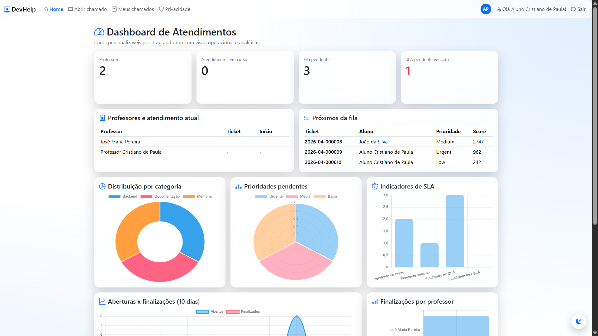 | 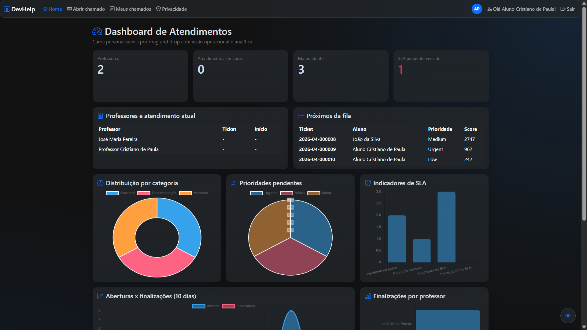 |
| **Fila de atendimento** | 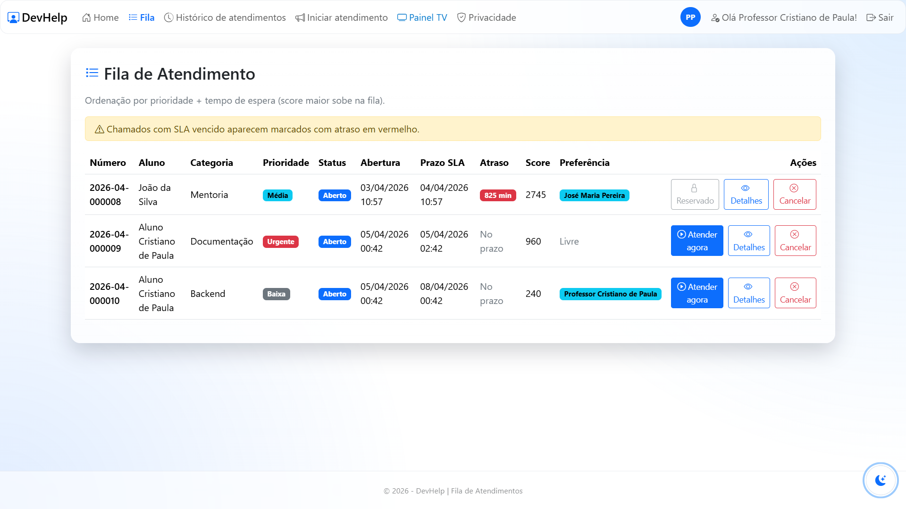 | 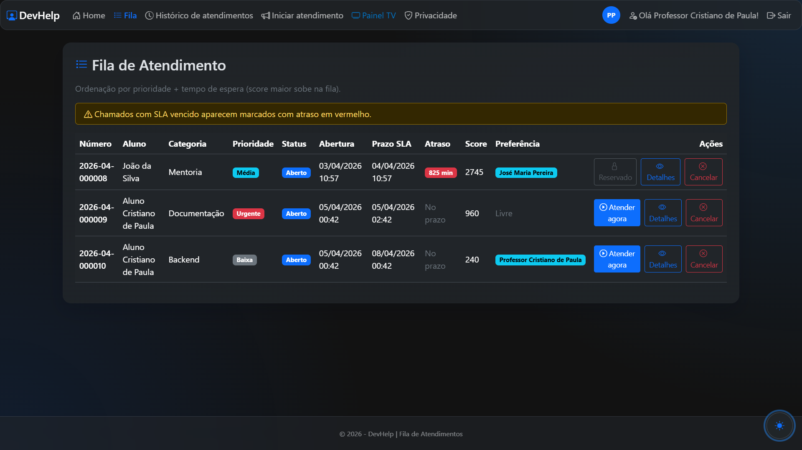 |
| **Histórico de atendimentos** | 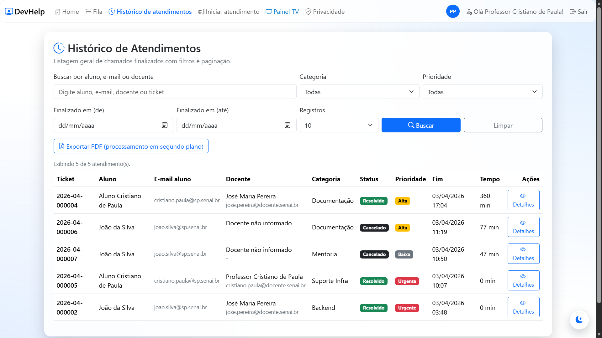 | 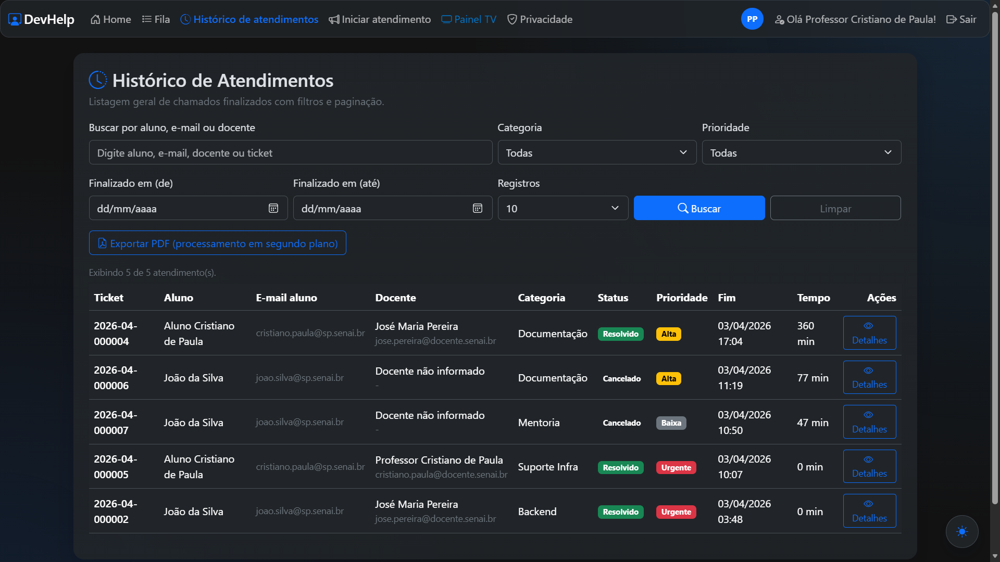 |
| **Abertura de chamado (Aluno)** | 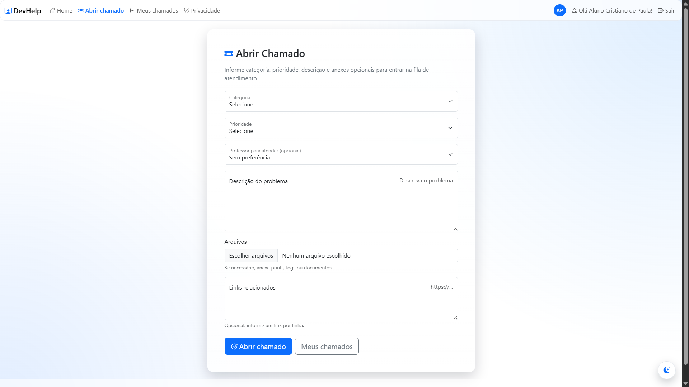 | 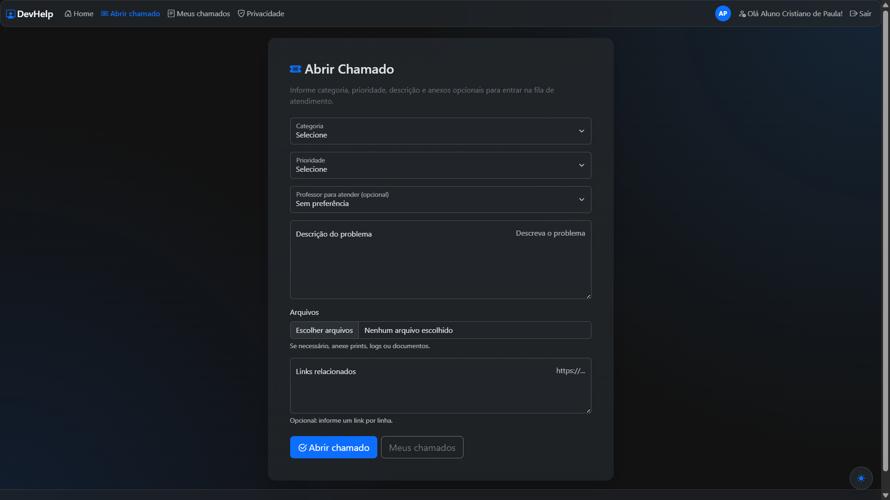 |
| **Meus chamados** | 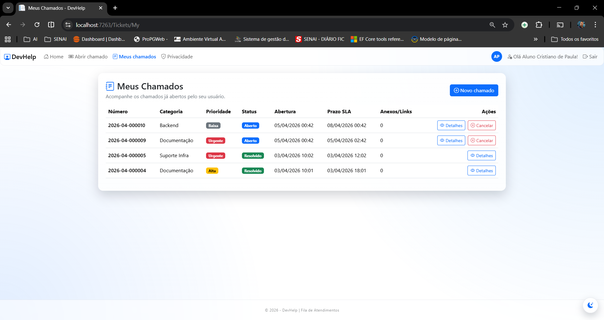 | 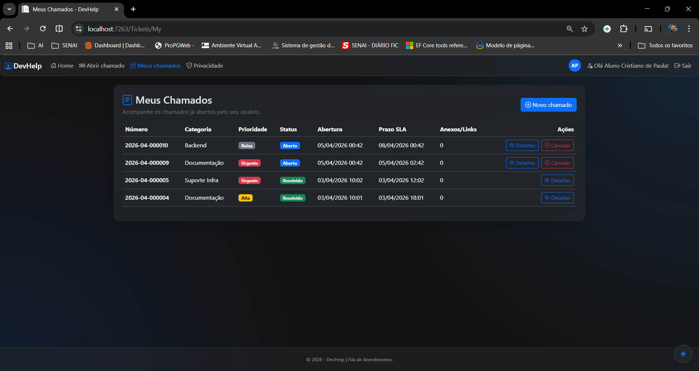 |
| **Atendimento / Detalhes do ticket** | 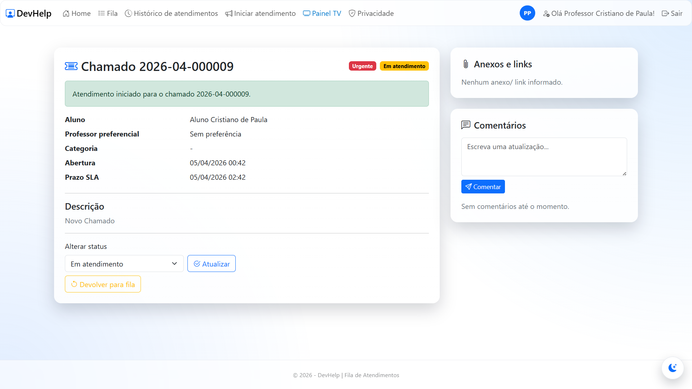 | 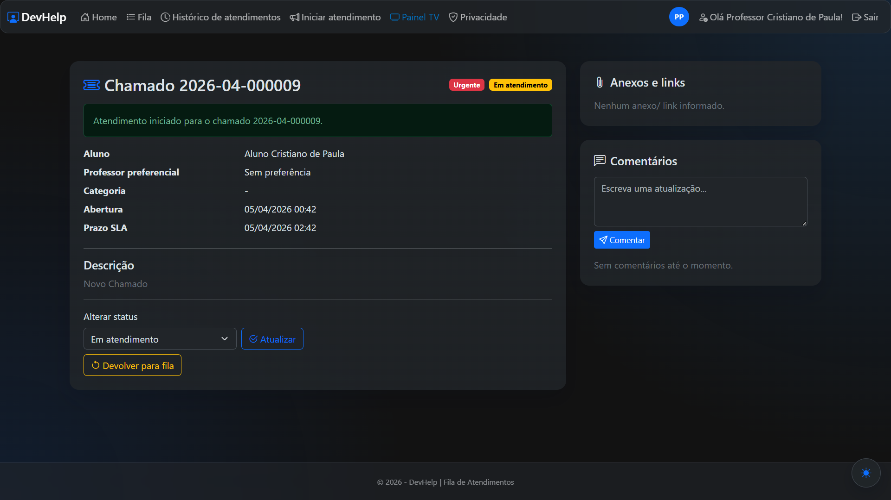 |
| **Painel TV** | 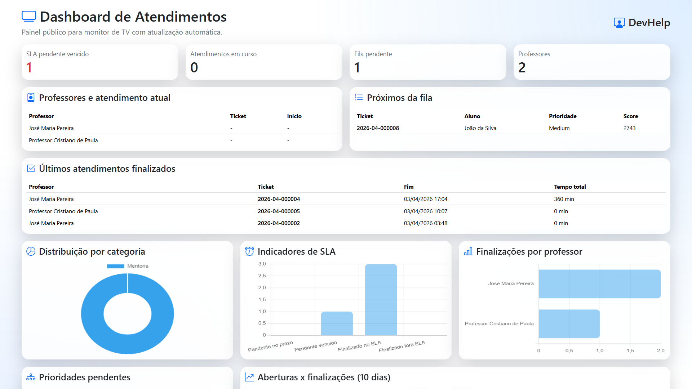 | 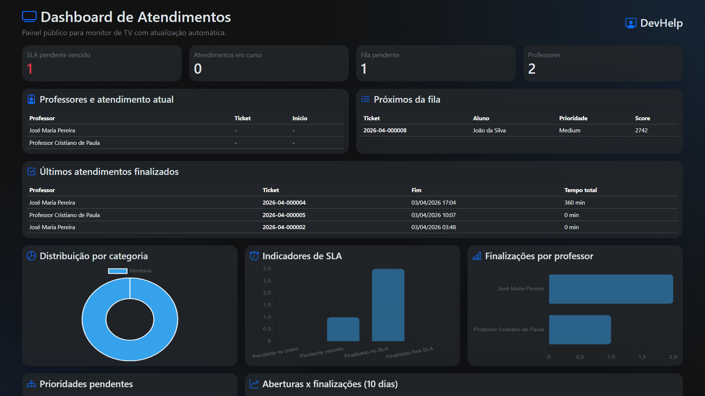 |

---

## 👨‍🏫 Sobre o uso em sala de aula

Este projeto foi conduzido como laboratório de desenvolvimento real, em que cada melhoria foi discutida, implementada e validada com os alunos, até chegar em uma versão robusta e orientada ao uso prático.

A proposta pedagógica reforça que software é construído em ciclos:
- entender o problema;
- implementar o mínimo funcional;
- validar com usuário;
- refinar continuamente.

---

## 📌 Status

Projeto em evolução contínua, com foco em:
- qualidade de experiência do usuário;
- consistência visual;
- robustez das regras de negócio;
- maturidade técnica dos alunos no ciclo completo de entrega.
